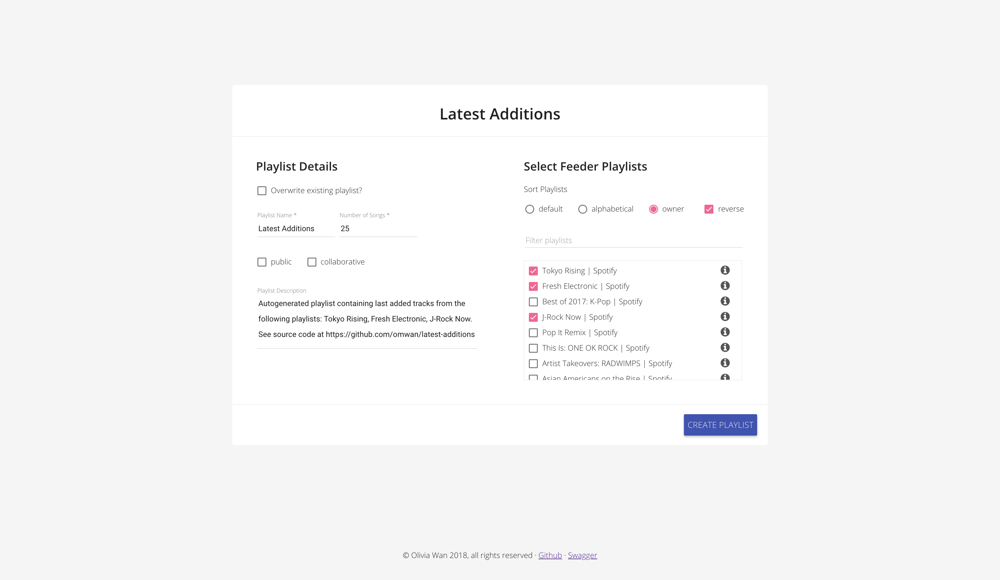
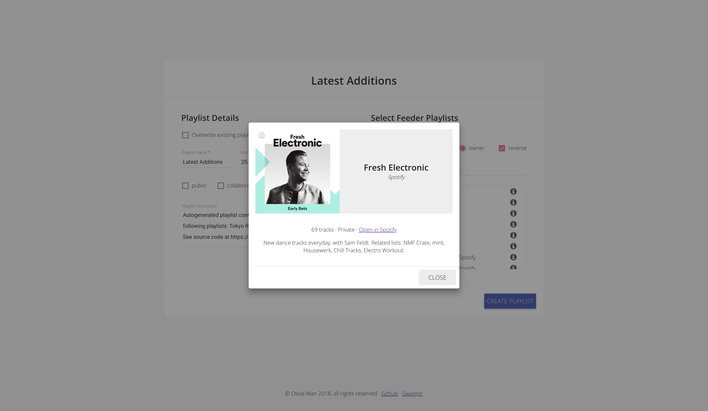

# latest-addition
Java/Spring Boot and AngularJS web application to generate a "latest additions" playlist from a selected set of Spotify playlists. Built with [spotify-web-api-java](https://github.com/thelinmichael/spotify-web-api-java) library.

**Links:**

* [Heroku web app](https://nameless-lowlands-57380.herokuapp.com) (note that application is running on free dynos, so it may take up to 30 seconds for first load of application)
* [Swagger UI](https://nameless-lowlands-57380.herokuapp.com/swagger-ui.html)

**Tools:**

* Java/Spring Boot
* AngularJS
* [Material AngularJS](https://material.angularjs.org/latest/)
* [Spotify Java API](https://github.com/thelinmichael/spotify-web-api-java)
* MongoDB
* Heroku

## How to use

If not already authorized, click "Authorize" button to connect your Spotify account to the application.

The left panel is where the specifications for the latest additions playlist belong, such as the name and description for the playlist. If you have previously created a playlist with the app, you can instead check the "Overwrite existing playlist" option to select a previously created playlist to overwrite.

In the right panel, all of your playlists (including those that you follow) are displayed; from there you can select the playlists to generate the "latest additions" playlist from. The radio buttons and filter allow you to limit and sort your playlists according to the specified query. The "information" icon beside each playlist can be clicked to open a dialog containing more information about the given playlist.

## Bugs/Todos

1. If a playlist previously created with the app is deleted from your Spotify account, it will still appear in the "Overwrite existing playlist" list due to limitations with the Java library.
   1. Proposed workaround: submit a bug ticket to spotify-web-api-java repo
2. Local tracks cannot be added to a playlist due to limitations in the Spotify API, and an 401 error is returned when that is attempted.
   1. Proposed workaround: skip local tracks
3. Duplicate tracks in selected playlists are not ignored at present.
   1. Proposed workaround: skip duplicate tracks

**Other todos:**

* toasts on success/failure
* loader icon while HTTP requests are being made
* save auth tokens to cookies instead of session history
* load selected feeder playlists for existing playlist

## Screencaps

